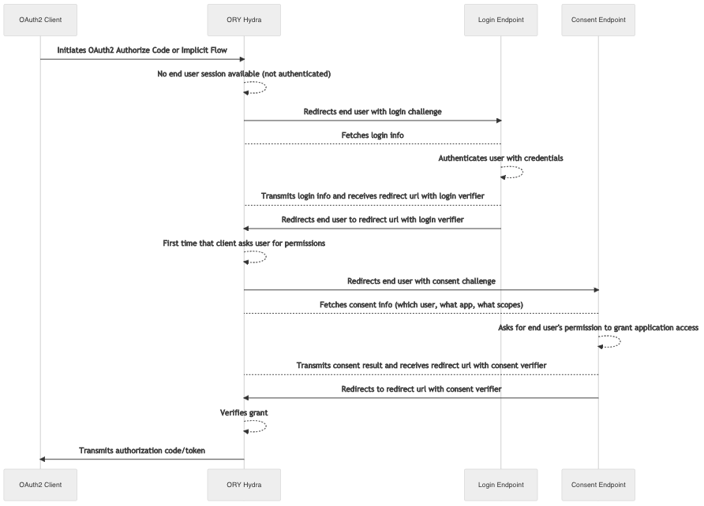
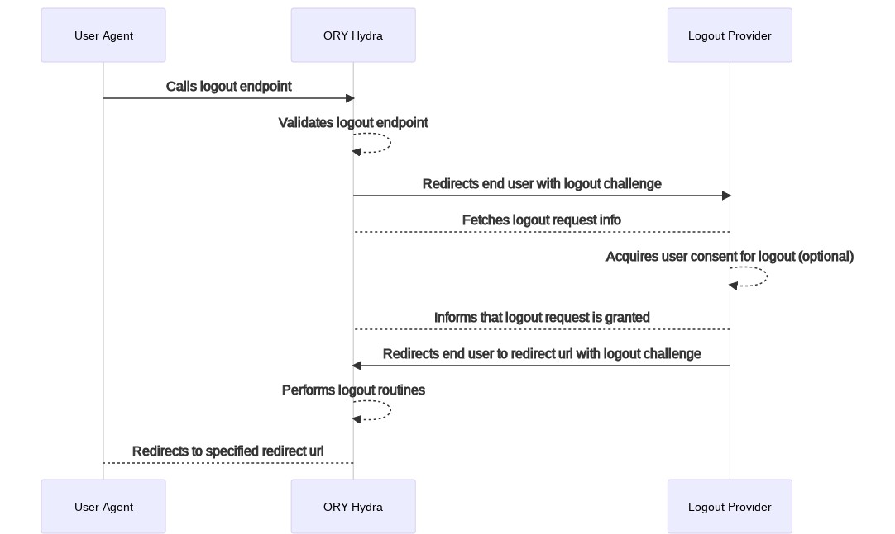

# ORY Hydra
ORY Hydra是经过强化，经过OpenID认证的OAuth 2.0服务器和OpenID Connect提供商。

## 特性
* 实现了OAuth2和OpenID Connect 1.0
* 轻量化，无用户管理，无权限管理，便于集成到现有系统
* 需由我们自主实现用户登录及授权逻辑，按它提供的接口进行接入即可
* Go语言开发，高性能、高并发

## 登录流程

## 登出流程


## 部署hydra服务
docker-compose.yml
```
version: $VERSION

services:
  hydra:
    image: oryd/hydra:v1.10.7
    container_name: hydra
    command: 
      serve -c /etc/config/hydra/hydra.yml all --dangerous-force-http
    environment:
      SECRETS_SYSTEM: $SECRETS_SYSTEM
      DSN: $DSN
      URLS_SELF_ISSUER: "http://127.0.0.1:4444/" # 服务器地址
      URLS_CONSENT: "http://127.0.0.1:8090/consent" # 接入的地址
      URLS_LOGIN: "http://127.0.0.1:8090/login" # 用户登录地址
    ports:
      - 4444:4444 # Public port
      - 4445:4445 # Admin port
    networks:
      - hydra

networks:
  hydra:
    driver: bridge
```

## 创建Client接口
在启动好hydra服务后，我们就可以通过http调用其接口，接下来看看/clients创建Client接口的Body

| 请求参数                                  |   参数类型     |   参数说明     |
| :---                                    |    :----:    |          ---: |
| client_id                               | 字符串        | 客户端id       |
| client_name                             | 字符串        | 客户端名称      |
| client_secret                           | 字符串        | 客户端秘钥      |
| client_secret_expires_at                | 数字          | 客户端秘钥过期时间， 目前不支持设置，值为0，表示一直使用      |
| created_at                              | 字符串        | 客户端创建时间   |
| frontchannel_logout_session_required    | 布尔值        | 结合frontchannel_logout_uri，处理前端会话注销 |
| frontchannel_logout_uri                 | 字符串        | 设置前端注销请求uri      |
| scope                                   | 字符串        | 客户端作用范围      |
| token_endpoint_auth_method              | 字符串        | client对token的验证方法，值选项有client_secret_post, client_secret_basic, private_key_jwt, none      |
| grant_types                             | 字符串        | 授予类型      |
| response_types                          | 字符串        | 响应类型      |

其他:
* allowed_cors_origins: 允许跨域的域名设置
* audience
* backchannel_logout_session_required: 若设置了backchannel_logout_uri，是否在logout token中包含session ID的声明
* backchannel_logout_uri: 登出请求url
* client_secret_expires_at: 目前不支持设置，值为0，表示一直使用
* client_uri: 提供client信息的内容网页
* contacts
* jwks
* jwks_uri
* logo_uri
* metadata
* owner
* policy_uri
* post_logout_redirect_uris
* redirect_uris
* request_object_signing_alg
* request_uris
* sector_identifier_uri
* subject_type
* token_endpoint_auth_method
* token_endpoint_auth_signing_alg
* tos_uri
* updated_at
* userinfo_signed_response_alg
