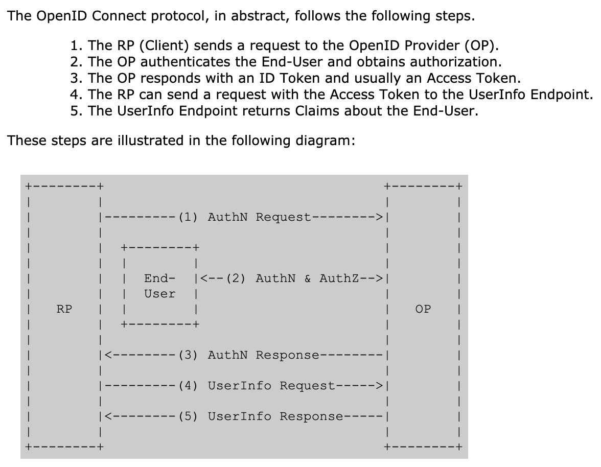

# OIDC
OIDC的全称是OpenID Connect，是一个基于OAuth 2.0的轻量级认证 + 授权协议，是OAuth 2.0的超集。

按本人理解其实是借鉴OpenID的身份标识，OAuth2的授权，JWT包装数据的方式，组合起来的一套身份认证授权方案

## 应用场景
OIDC使用OAuth2的授权服务器来为第三方客户端提供用户的身份认证，并把对应的身份认证信息传递给客户端，且可以适用于各种类型的客户端（比如服务端应用，移动APP，JS应用），且完全兼容OAuth2。
也就是说你搭建了一个OIDC的服务后，也可以当作一个OAuth2的服务来用。应用场景如图：

### 现有的开源OIDC开源项目
* [ORY Hrdra](https://github.com/ory/hydra)

### OIDC 实践
* [阿里云 API 网关 OpenID Connect 使用指南](https://help.aliyun.com/document_detail/48019.html)

### 现有的OIDC Provider开源项目
根据不同语言实现，推荐如下
* JS: [node-oidc-provider](https://github.com/panva/node-oidc-provider)
* GO: [dex](https://github.com/dexidp/dex)
* Python: [django-oidc-provider](https://github.com/juanifioren/django-oidc-provider)

## 术语介绍
* EU End-User: 指用户(一般指有账号的个体，资源的拥有者)
* RP Relying Party: 信任方(一般是一个软件应用), 理解为OAuth2中的客户端(Client)即可, 需要在OP中注册
* OP OpenID Provider: 能提供对EU进行认证的服务端(可理解为OAuth2中授权服务端), 提供RP的注册(或管理)能力，EU管理，ID Token的签发与管理等。OIDC中的核心组件
* ID Token: 格式为JSON Web Token(JWT),包含EU认证授权信息等
  * JSON Web Key(JWK)
  * JSON Web Encryption(JWE): 加密
  * JSON Web Algorithm(JWA): 
  * JSON Web Signature(JWS): 签名
* UserInfo Endpoint: EU信息接口(OAuth2保护), 在RP获取到access_token后,可调用此接口获取EU的详细信息,OIDC要求此接口必须使用https访问(更安全),一般在OP中提供的Discovery中获取
* Claim: EU信息的载体, 可在ID Token中获取,主要包括认证信息与授权信息，可根据实际扩展

## 流程

这里翻译一下流程:
* RP发送一个认证请求给OP
* OP对EU进行身份认证，然后提供授权
* OP把ID Token和Access Token(需要的话)返回给RP
* RP使用Access Token发送一个请求UserInfo EndPoint
* UserInfo EndPoint返回EU的Claims

## 协议簇
OIDC本身是有多个规范构成，其中包含一个核心的规范，多个可选支持的规范来提供扩展支持
* Core: 必选。定义OIDC的核心功能，在OAuth 2.0之上构建身份认证，以及如何使用Claims来传递用户的信息。
* Discovery: 可选。发现服务，使客户端可以动态的获取OIDC服务相关的元数据描述信息（比如支持那些规范，接口地址是什么等等）。
* Dynamic Registration: 可选。动态注册服务，使客户端可以动态的注册到OIDC的OP。
* OAuth 2.0 Multiple Response Types: 可选。针对OAuth2的扩展，提供几个新的response_type。
* OAuth 2.0 Form Post Response Mode: 可选。针对OAuth2的扩展，OAuth2回传信息给客户端是通过URL的querystring和fragment这两种方式，这个扩展标准提供了一基于form表单的形式把数据post给客户端的机制。
* Session Management: 可选。Session管理，用于规范OIDC服务如何管理Session信息。
* Front-Channel Logout: 可选。基于前端的注销机制，使得RP可以不使用OP的iframe来退出。
* Back-Channel Logout：可选。基于后端的注销机制，定义了RP和OP直接如何通信来完成注销。

这里有[官方](https://openid.net/connect/)的一张OIDC组成结构图，先只关注Core部分，其他内容在后面了解

## OIDC核心概念
* Access Token: OAuth2提供了Access Token来解决授权第三方客户端访问受保护资源的问题
* ID Token: OIDC在Access Token的基础上提供ID Token来解决第三方客户端标识用户身份认证的问题。
* JWT: 在OAuth2的授权流程中，OIDC提供用户的身份认证信息（ID Token）给到第三方客户端，ID Token使用JWT格式来包装安全传递给第三方客户端被验证。

### ID Token
ID Token是一个安全令牌，是一个授权服务器提供的包含用户信息(由一组Cliams构成以及其他辅助的Cliams)的JWT格式的数据结构。
ID Token(使用OAuth2流程的OIDC)的主要构成部分如下:
* iss = Issuer Identifier: 必须。提供认证信息者的唯一标识。一般是一个https协议的域名。
* sub = Subject Identifier: 必须。iss提供的EU的标识，在iss范围内唯一。它会被RP用来标识唯一的用户。最长为255个ASCII个字符。
* aud = Audience(s): 必须。标识ID Token的受众。必须包含OAuth2的client_id。
* exp = Expiration time: 必须。过期时间，超过此时间的ID Token会作废不再被验证通过。
* iat = Issued At Time: 必须。JWT的构建的时间。
* auth_time = AuthenticationTime: EU完成认证的时间。如果RP发送Auth请求的时候携带max_age的参数，则此Claim是必须的。
* nonce: RP发送请求的时候提供的随机字符串，用来减缓重放攻击，也可以来关联ID Token和RP本身的Session信息。
* acr = Authentication Context Class Reference: 可选。表示一个认证上下文引用值，可以用来标识认证上下文类。
* amr = Authentication Methods References: 可选。表示一组认证方法。
* azp = Authorized party: 可选。结合aud使用。只有在被认证的一方和受众（aud）不一致时才使用此值，一般情况下很少使用。

ID Token通常情况下还会包含其他的Claims, 另外ID Token必须使用JWS进行签名和JWE加密，从而提供认证的完整性、不可否认性以及可选的保密性。

## 授权流程
* Authorization Code Flow: 使用OAuth2的授权码来换取Id Token和Access Token
* Implicit Flow: 使用OAuth2的Implicit流程获取Id Token和Access Token
* Hybrid Flow: 混合Authorization Code Flow+Implici Flow

## 协议
* [Version 1.0 英文原版](http://openid.net/specs/openid-connect-core-1_0.html)
* [JSON Web Signature(JWT)](https://tools.ietf.org/html/rfc7515)
* [JSON Web Encryption(JWE)](http://tools.ietf.org/html/draft-ietf-jose-json-web-encryption)
* [JSON Web Key(JWK)](https://tools.ietf.org/html/draft-ietf-jose-json-web-key-41)

