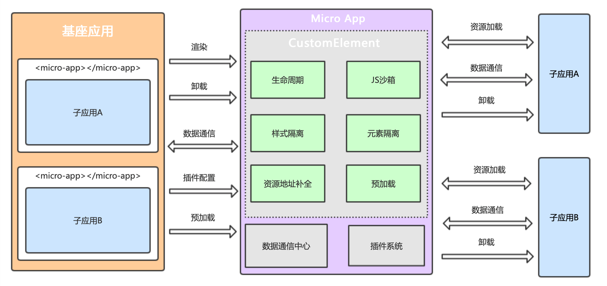

# Micro App
micro-app借鉴了WebComponent的思想，通过CustomElement结合自定义的ShadowDom，将微前端封装成一个类WebComponent组件，从而实现微前端的组件化渲染。

并且由于自定义ShadowDom的隔离特性，micro-app不需要像single-spa和qiankun一样要求子应用修改渲染逻辑并暴露出方法，也不需要修改webpack配置，是目前市面上接入微前端成本最低的方案。

## 核心原理
Micro App 的核⼼功能在CustomElement基础上进⾏构建，CustomElement⽤于创建⾃定义标签，并提供了元素的渲染、卸载、属性修改等钩⼦函数，通过钩⼦函数获知微应⽤的渲染时机，并将⾃定义标签作为容器，微应⽤的所有元素和样式作⽤域都⽆法逃离容器边界，从⽽形成⼀个封闭的环境。

## 概念图

## JS沙箱

## 样式隔离

## 元素隔离

## 数据通信

## 静态资源

## 预加载

## 路由

## 应用之间跳转